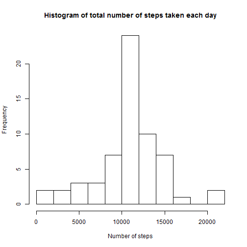

Reproducible Research: Peer Assessment 1
======================================== 

## Loading and preprocessing the data


```r
activity <- read.csv("./activity/activity.csv")

# Preview the data
head(activity)
```

```
##   steps       date interval
## 1    NA 2012-10-01        0
## 2    NA 2012-10-01        5
## 3    NA 2012-10-01       10
## 4    NA 2012-10-01       15
## 5    NA 2012-10-01       20
## 6    NA 2012-10-01       25
```

```r
str(activity)
```

```
## 'data.frame':	17568 obs. of  3 variables:
##  $ steps   : int  NA NA NA NA NA NA NA NA NA NA ...
##  $ date    : Factor w/ 61 levels "2012-10-01","2012-10-02",..: 1 1 1 1 1 1 1 1 1 1 ...
##  $ interval: int  0 5 10 15 20 25 30 35 40 45 ...
```

```r
summary(activity)
```

```
##      steps                date          interval     
##  Min.   :  0.00   2012-10-01:  288   Min.   :   0.0  
##  1st Qu.:  0.00   2012-10-02:  288   1st Qu.: 588.8  
##  Median :  0.00   2012-10-03:  288   Median :1177.5  
##  Mean   : 37.38   2012-10-04:  288   Mean   :1177.5  
##  3rd Qu.: 12.00   2012-10-05:  288   3rd Qu.:1766.2  
##  Max.   :806.00   2012-10-06:  288   Max.   :2355.0  
##  NA's   :2304     (Other)   :15840
```


## What is mean total number of steps taken per day?

* Make a histogram of the total number of steps taken each day.


```r
# Load dplyr package
library(dplyr)
```

```
## 
## Attaching package: 'dplyr'
## 
## The following object is masked from 'package:stats':
## 
##     filter
## 
## The following objects are masked from 'package:base':
## 
##     intersect, setdiff, setequal, union
```

```r
# Total number of steps taken per day
totsteps <- summarise(group_by(activity, date), total_steps = sum(steps, na.rm=TRUE))

# Make a histogram
hist(totsteps$total_steps, breaks=10, xlab="Number of steps", 
     main="Histogram of total number of steps taken each day")
```

 

* Calculate and report the mean and median total number of steps taken per day.


```r
meansteps <- mean(totsteps$total_steps)
mediansteps <- median(totsteps$total_steps)
print(c("Mean" = meansteps, "Median" = mediansteps))
```

```
##     Mean   Median 
##  9354.23 10395.00
```


## What is the average daily activity pattern?

* Make a time series plot (i.e. type = "l") of the 5-minute interval (x-axis) and the average number of steps taken, averaged across all days (y-axis).


```r
# Calculate the average number of steps 
avgsteps <- summarise(group_by(activity, interval), avg_steps = mean(steps, na.rm=TRUE))

# Time series plot
plot(avgsteps$interval, avgsteps$avg_steps, type = "l", 
                    main="Average number of steps of the 5-minute interval",
                    xlab="interval", ylab="number of steps")
```

 
 
* Which 5-minute interval, on average across all the days in the dataset, contains the maximum number of steps?


```r
avgsteps[which(avgsteps$avg_steps == max(avgsteps$avg_steps)),]
```

```
## Source: local data frame [1 x 2]
## 
##   interval avg_steps
## 1      835  206.1698
```


## Imputing missing values

* Calculate and report the total number of missing values in the dataset (i.e. the total number of rows with NAs).


```r
sum(is.na(activity$steps))
```

```
## [1] 2304
```

* Devise a strategy for filling in all of the missing values in the dataset. For the intervals with missing values, I use the mean(=average) number of steps of each interval, averaged across all days. This is already calculated in the previous step.  

* Create a new dataset that is equal to the original dataset but with the missing data filled in.


```r
# Merge the mean number of steps of each interval into the original data and re-sort
d <- merge(activity, avgsteps)
d <- arrange(d, date, interval)

# Fill in the missing values
for(i in 1:dim(d)[1]) {
        if(is.na(d$steps[i])) {
                d$steps[i] <- d$avg_steps[i]
        }
}

# New dataset
new_activity <- data.frame(steps = d$steps, date = d$date, interval = d$interval)
```

* Make a histogram of the total number of steps taken each day and Calculate and report the mean and median total number of steps taken per day. Do these values differ from the estimates from the first part of the assignment? What is the impact of imputing missing data on the estimates of the total daily number of steps?


```r
# Total number of steps taken per day with new data
new_totsteps <- summarise(group_by(new_activity, date), total_steps = sum(steps))

# Make a histogram with new data
hist(new_totsteps$total_steps, breaks=10, xlab="Number of steps", 
     main="Histogram of total number of steps taken each day")
```

 

```r
# Mean and median total number of steps taken per day with new data
new_meansteps <- mean(new_totsteps$total_steps)
new_mediansteps <- median(new_totsteps$total_steps)
print(c("new Mean" = new_meansteps, "new Median" = new_mediansteps))
```

```
##   new Mean new Median 
##   10766.19   10766.19
```

When imputing missing values using average number of steps for each interval across all days, the mean and median values become different from those in the first part. Both values have increased and the new mean and median get to be equal. In the first part, when missing values were ignored, many zero values were introduced for the days with all missing intervals. This is why we had high frequency of zeros in the first histogram. Imputing missing value strategy I adopted here makes the new histogram more symmetric around mean by adjusting many zero values of total daily number of steps to mean values.  


## Are there differences in activity patterns between weekdays and weekends?

* Create a new factor variable in the dataset with two levels -- "weekday" and "weekend" indicating whether a given date is a weekday or weekend day.


```r
# Create a factor variable
new_activity$weekdays <- weekdays(as.Date(new_activity$date), abbreviate=TRUE)
for(i in 1:dim(new_activity)[1]) {
        if(new_activity$weekdays[i]=="Sat" | new_activity$weekdays[i]=="Sun") {
                new_activity$weekdays.f[i] <- c("weekend") 
        }
        else new_activity$weekdays.f[i] <- c("weekday")
}
```

* Make a panel plot containing a time series plot (i.e. type = "l") of the 5-minute interval (x-axis) and the average number of steps taken, averaged across all weekday days or weekend days (y-axis). 


```r
# Calculate the average number of steps 
new_avgsteps <- summarise(group_by(new_activity, interval, weekdays.f), 
                          avg_steps = mean(steps, na.rm=TRUE))

# Time series plot
library(ggplot2)
g <- ggplot(new_avgsteps, aes(interval, avg_steps))
g + geom_line(aes(color = weekdays.f)) +
    facet_grid(weekdays.f ~ .) +
    labs(x = "interval") +
    labs(y = "average number of steps")
```

 
